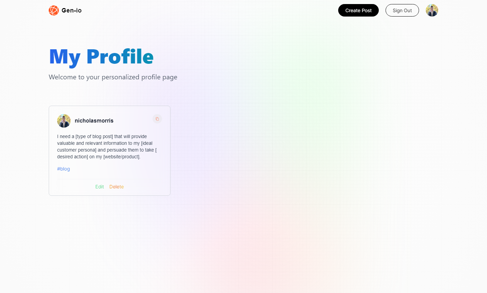
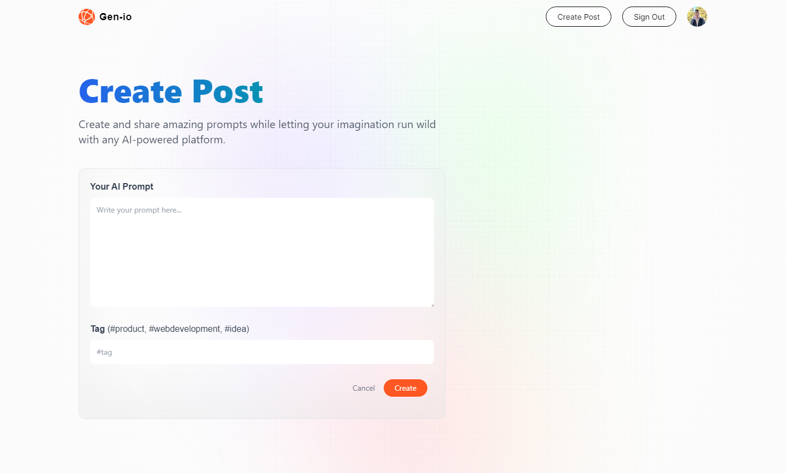

# Gen-io

## Description

This project is created using Nextjs, utilizing the powerful reactive nature of React and mobile first directive of Tailwind. The purpose of this project is to allow an open source web application that allows many users to share ChatGPT prompts that have helped them through their development process. Using AI to assist in clean code, or quick advice in a way of thinking, is an excellent resource that developers can utilize. Now, developers can share and manage which prompts worked best and contribute more information to the community.

## Usage

Once again, this is an open source, community based, assist tool that should be used to grow the development community with powerful AI assistance.

### Preview

View the application live here: https://gen-io.vercel.app/

#### Homepage

#### Personal Profile

#### User Profile

#### Create Post

## Deployed on Vercel

This project was built using Nextjs which allows for very easy deployment on Vercel. This was the first time using Vercel and I was surprised by just how simple the setup and deployment is since it is specifically built for Nextjs. I will certainly be using Vercel in the future for my Nextjs projects and continue building this project as new ideas come.

## Further Development

Since this is an open source project, I would love any future ideas that could be added. Always feel free to reach out to me as I am happy to work with more developers within the community!